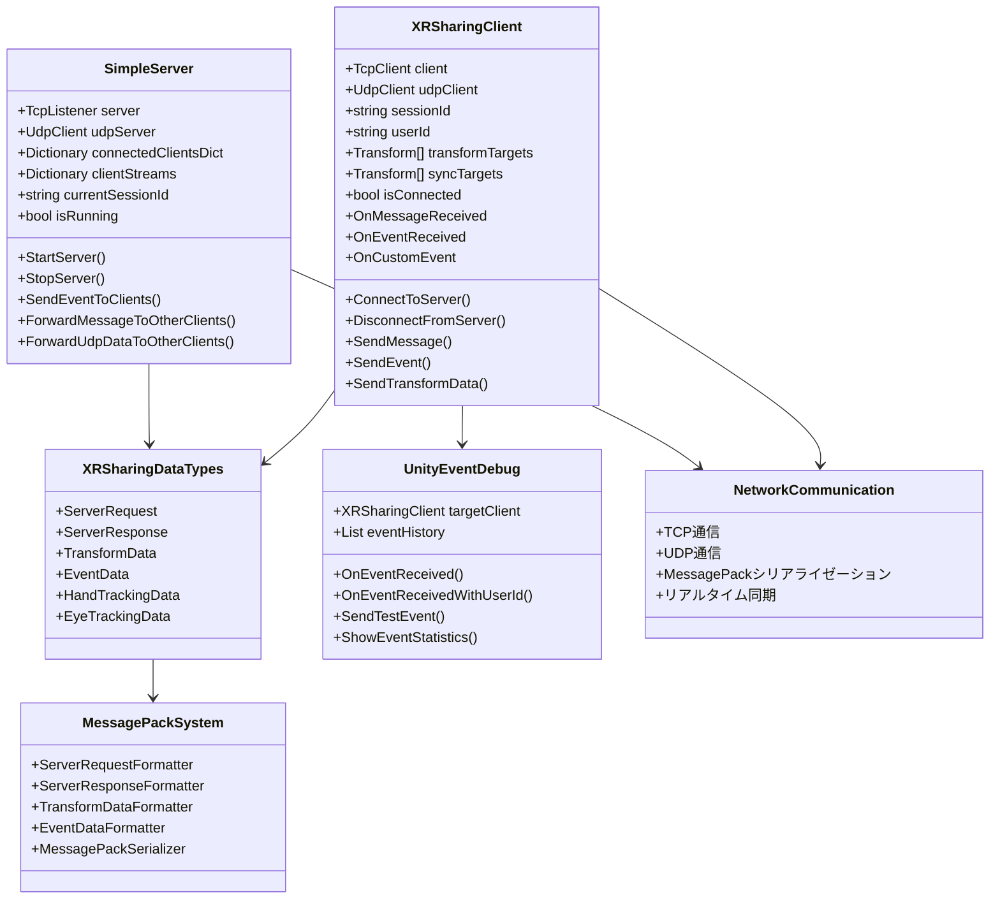

# 3rdPosonViewOrSharingAppForXR

XR（拡張現実）アプリケーション向けのリアルタイム位置・姿勢共有システムです。TCP/UDP通信を使用して、複数のXRデバイス間でTransformデータとイベントを同期します。

## 📋 プロジェクト概要

このプロジェクトは、Unity 2022.3 LTSで開発されたXRアプリケーション用のネットワーク共有システムです。複数のXRデバイス（Quest、iPad、Desktop等）間でリアルタイムに位置・姿勢データを共有し、インタラクティブなイベントシステムを提供します。

## 🚀 主な機能

- **リアルタイムTransform同期**: UDP通信による高頻度位置・姿勢データ共有
- **TCPイベントシステム**: 特定のセッションIDやユーザーIDを指定したイベント送信
- **マルチプラットフォーム対応**: Quest、iPad、Desktop、その他XRデバイス
- **MessagePackシリアライゼーション**: 高速で効率的なデータ通信
- **UnityEvent統合**: Inspectorで設定可能なイベントシステム
- **デバッグツール**: リアルタイム通信状況の監視・デバッグ

## 🛠️ 技術仕様

### Unity バージョン
- **Unity 2022.3 LTS** (6000.2.0f1)

### 使用パッケージ
- Universal Render Pipeline (17.2.0)
- Input System (1.14.1)
- MessagePack (カスタム実装)
- XR Support

### 通信プロトコル
- **TCP**: イベント送信・受信、メッセージング
- **UDP**: Transformデータの高頻度送信
- **MessagePack**: バイナリシリアライゼーション

### 対応プラットフォーム
- Meta Quest 2/3/Pro
- iPad (AR Foundation)
- Windows Desktop
- macOS Desktop
- Android/iOS

## 📁 プロジェクト構造

```
3rdPosonViewOrSharingAppForXR/
├── SodaUnityServer/
│   ├── Assets/
│   │   ├── Scripts/
│   │   │   ├── SimpleServer.cs              # TCP/UDPサーバー
│   │   │   ├── XRSharingClient.cs           # クライアント通信
│   │   │   ├── XRSharingDataTypes.cs        # データ型定義
│   │   │   └── Debug/
│   │   │       └── UnityEventDebug.cs        # デバッグツール
│   │   ├── Plugins/                         # MessagePack DLL
│   │   └── Scenes/
│   │       └── SampleScene.unity           # サンプルシーン
│   ├── MessagePack/                         # MessagePackライブラリ
│   └── ProjectSettings/                     # Unity設定
└── README.md
```

## 🎯 システムアーキテクチャ

### 通信フロー
1. **接続確立**: クライアントがサーバーにTCP/UDP接続
2. **セッション管理**: サーバーがセッションIDとユーザーIDを割り当て
3. **Transform同期**: UDPで高頻度位置・姿勢データを送信
4. **イベント送信**: TCPでイベントを特定のクライアントに送信
5. **リアルタイム同期**: 全クライアント間でデータを同期

### データ型
- **ServerRequest/Response**: TCP通信用メッセージ
- **TransformData**: UDP通信用位置・姿勢データ
- **EventData**: イベント送信用データ
- **HandTrackingData**: ハンドトラッキングデータ
- **EyeTrackingData**: アイトラッキングデータ

## 🚀 セットアップ

### 前提条件
- Unity 2022.3 LTS 以降
- Visual Studio または Visual Studio Code
- Git
- XR対応デバイス（オプション）

### インストール手順

1. **リポジトリのクローン**
   ```bash
   git clone https://github.com/your-username/3rdPosonViewOrSharingAppForXR.git
   cd 3rdPosonViewOrSharingAppForXR
   ```

2. **Unity プロジェクトを開く**
   - Unity Hub を起動
   - "Add project from disk" を選択
   - `SodaUnityServer` フォルダを選択

3. **依存関係のインストール**
   - Unity が自動的にパッケージをダウンロード
   - MessagePackライブラリが自動的に設定

## 📖 使用方法

### 基本的な使用方法

#### 1. サーバーの起動
```csharp
// SimpleServerコンポーネントをGameObjectにアタッチ
// Inspectorで設定を調整
// "サーバー開始"ボタンをクリック
```

#### 2. クライアントの接続
```csharp
// XRSharingClientコンポーネントをGameObjectにアタッチ
// サーバーURLを設定
// "接続"ボタンをクリック
```

#### 3. Transform同期の設定
```csharp
// Transform配列を設定
public Transform[] transformTargets;  // 送信するTransform
public Transform[] syncTargets;       // 同期するTransform

// 自動同期を有効化
enableAutoSync = true;
```

#### 4. イベントシステムの使用
```csharp
// イベント送信
client.SendEvent("BUTTON_CLICK", "{\"buttonName\":\"StartButton\"}");

// イベント受信（Inspectorで設定）
OnCustomEvent.AddListener((eventType, eventData) => {
    if (eventType == "BUTTON_CLICK") {
        // ボタンクリック処理
    }
});
```

### 高度な使用方法

#### 特定のユーザーにイベント送信
```csharp
// 特定のユーザーIDに送信
client.SendEvent("PRIVATE_MESSAGE", "{\"message\":\"Hello\"}", "", "user_2");

// 特定のセッションIDに送信
client.SendEvent("SESSION_EVENT", "{\"data\":\"value\"}", "session_123");
```

#### カスタムイベントの実装
```csharp
// カスタムイベントデータクラス
[System.Serializable]
public class CustomEventData
{
    public string action;
    public Vector3 position;
    public int value;
}

// イベント送信
var eventData = new CustomEventData
{
    action = "MOVE_OBJECT",
    position = transform.position,
    value = 100
};
client.SendEvent("CUSTOM_ACTION", JsonUtility.ToJson(eventData));
```

## 🎯 クラス図



## 🔧 開発ガイドライン

### パフォーマンス最適化

1. **Transform送信頻度の調整**
   ```csharp
   // 送信間隔を調整（デフォルト: 0.1秒 = 10fps）
   transformSendInterval = 0.05f; // 20fps
   ```

2. **スムージングの設定**
   ```csharp
   // スムージング係数（0-1）
   smoothingFactor = 0.1f; // 低い値 = より滑らか
   ```

3. **メモリ使用量の最適化**
   ```csharp
   // バッファサイズの調整
   byte[] buffer = new byte[8192]; // デフォルト: 4096
   ```

### デバッグ方法

1. **UnityEventDebugの使用**
   - イベント履歴の確認
   - 通信状況の監視
   - 統計情報の表示

2. **ログレベルの調整**
   ```csharp
   // デバッグログの有効/無効
   enableDebugLogs = true;
   ```

3. **ネットワーク状況の確認**
   - 接続状態の表示
   - 送信/受信データの確認
   - エラーログの監視

## 📚 API リファレンス

### SimpleServer

#### 主要メソッド
- `StartServer()`: サーバーを開始
- `StopServer()`: サーバーを停止
- `SendEventToClients(eventType, eventData, targetSessionId, targetUserId)`: イベント送信

#### プロパティ
- `isRunning`: サーバー実行状態
- `connectedClients`: 接続クライアント数
- `currentSessionId`: 現在のセッションID

### XRSharingClient

#### 主要メソッド
- `ConnectToServer()`: サーバーに接続
- `DisconnectFromServer()`: サーバーから切断
- `SendMessage(message)`: メッセージ送信
- `SendEvent(eventType, eventData, targetSessionId, targetUserId)`: イベント送信
- `SendTransformData(transform, index)`: Transform送信

#### イベント
- `OnMessageReceived`: メッセージ受信
- `OnEventReceived`: イベント受信
- `OnCustomEvent`: UnityEvent（Inspector設定可能）
- `OnTransformReceived`: Transform受信
- `OnConnected`: 接続完了
- `OnDisconnected`: 切断完了
- `OnError`: エラー発生

## 🤝 コントリビューション

### 貢献方法

1. **Fork する**
   - このリポジトリをフォーク

2. **ブランチを作成**
   ```bash
   git checkout -b feature/your-feature-name
   ```

3. **変更をコミット**
   ```bash
   git commit -m "Add: 新機能の説明"
   ```

4. **プッシュ**
   ```bash
   git push origin feature/your-feature-name
   ```

5. **プルリクエストを作成**

### コーディング規約

- **C#コード**: Microsoft C# コーディング規約に従う
- **コメント**: 日本語または英語で記述
- **命名規則**: Unity標準に従う
- **インデント**: スペース4文字

## 📄 ライセンス

このプロジェクトは MIT ライセンスの下で公開されています。詳細は [LICENSE](LICENSE) ファイルを参照してください。

## 👥 作者

- **開発者**: 清島浩徳
- **所属**: 崇城大学
- **連絡先**: [GitHub Profile](https://github.com/your-username)

## 📞 サポート

### 問題の報告
- [Issues](https://github.com/your-username/3rdPosonViewOrSharingAppForXR/issues) で問題を報告
- バグレポートには再現手順を含める

### 質問・相談
- [Discussions](https://github.com/your-username/3rdPosonViewOrSharingAppForXR/discussions) で質問
- 技術的な相談も歓迎

## 🔄 更新履歴

### v1.0.0 (2024-01-XX)
- 初回リリース
- TCP/UDP通信システム
- Transform同期機能
- イベントシステム
- UnityEvent統合
- デバッグツール

## 🚀 今後の予定

- [ ] WebRTC対応
- [ ] 音声・映像ストリーミング
- [ ] クラウドサーバー対応
- [ ] モバイル最適化
- [ ] セキュリティ強化

---

**注意**: このプロジェクトは学習・研究目的で作成されています。商用利用の場合は適切なライセンス確認を行ってください。