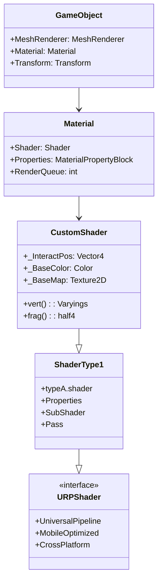

# SODA3dartShader

Unity用のカスタムシェーダープロジェクトです。Universal Render Pipeline (URP) を使用したモダンなシェーダー開発環境を提供します。

## 📋 プロジェクト概要

このプロジェクトは、Unity 2022.3 LTS以降で動作するカスタムシェーダーの開発・学習用プロジェクトです。URP（Universal Render Pipeline）を使用して、モバイルからPCまで幅広いプラットフォームに対応したシェーダーを作成できます。

## 🚀 主な機能

- **Universal Render Pipeline (URP) 対応**
- **モバイル最適化されたシェーダー**
- **カスタムシェーダータイプの実装**
- **インタラクティブなシェーダー効果**

## 🛠️ 技術仕様

### Unity バージョン
- **Unity 2022.3 LTS** (6000.2.0f1)

### 使用パッケージ
- Universal Render Pipeline (17.2.0)
- Input System (1.14.1)
- Visual Scripting (1.9.7)
- Timeline (1.8.7)

### 対応プラットフォーム
- Windows
- macOS
- Android
- iOS
- WebGL

## 📁 プロジェクト構造

```
Soda3dartShader/
├── Assets/
│   ├── Shader/
│   │   └── ShaderType1/
│   │       └── typeA.shader          # カスタムシェーダーA
│   ├── Scenes/
│   │   └── SampleScene.unity         # サンプルシーン
│   └── Settings/                     # URP設定ファイル
├── Packages/
│   └── manifest.json                 # パッケージ依存関係
└── ProjectSettings/                  # プロジェクト設定
```

## 🎨 シェーダー仕様

### typeA.shader
基本的なテクスチャマッピングとカラーティント機能を提供するシェーダーです。

#### プロパティ
- `_InteractPos`: インタラクション位置 (Vector4)
- `_BaseColor`: ベースカラー (Color)
- `_BaseMap`: ベーステクスチャ (2D Texture)

#### 特徴
- URP対応
- モバイル最適化
- インタラクティブな位置ベースの効果

## 🚀 セットアップ

### 前提条件
- Unity 2022.3 LTS 以降
- Visual Studio または Visual Studio Code
- Git

### インストール手順

1. **リポジトリのクローン**
   ```bash
   git clone https://github.com/your-username/SODA3dartShader.git
   cd SODA3dartShader
   ```

2. **Unity プロジェクトを開く**
   - Unity Hub を起動
   - "Add project from disk" を選択
   - `Soda3dartShader` フォルダを選択

3. **依存関係のインストール**
   - Unity が自動的にパッケージをダウンロード
   - 初回起動時は時間がかかる場合があります

## 📖 使用方法

### 基本的な使用方法

1. **シーンを開く**
   - `Assets/Scenes/SampleScene.unity` を開く

2. **シェーダーを適用**
   - マテリアルを作成
   - シェーダーを "Custom/typeA" に設定
   - オブジェクトにマテリアルを適用

3. **パラメータの調整**
   - Inspector でシェーダープロパティを調整
   - リアルタイムで効果を確認

### カスタムシェーダーの作成

1. **新しいシェーダーファイルを作成**
   ```hlsl
   Shader "Custom/YourShader"
   {
       Properties
       {
           // プロパティを定義
       }
       
       SubShader
       {
           // シェーダーコードを記述
       }
   }
   ```

2. **URP対応の設定**
   - `Tags { "RenderPipeline" = "UniversalPipeline" }` を追加
   - URP用のインクルードファイルを使用

## 🎯 クラス図



## 🔧 開発ガイドライン

### シェーダー開発のベストプラクティス

1. **パフォーマンス最適化**
   - 不要な計算を避ける
   - テクスチャサンプリングを最小限に
   - モバイル向けの最適化を考慮

2. **コードの可読性**
   - 適切なコメントを記述
   - 変数名を分かりやすく
   - 構造化されたコード

3. **クロスプラットフォーム対応**
   - プラットフォーム固有の処理を避ける
   - URPの機能を活用
   - モバイルとPCの両方でテスト

### デバッグ方法

1. **Frame Debugger の使用**
   - Window > Analysis > Frame Debugger
   - シェーダーの実行状況を確認

2. **Shader Graph との比較**
   - 複雑なシェーダーは Shader Graph で作成
   - カスタムシェーダーとの性能比較

## 📚 参考資料

### Unity公式ドキュメント
- [Universal Render Pipeline](https://docs.unity3d.com/Packages/com.unity.render-pipelines.universal@latest/)
- [Shader Graph](https://docs.unity3d.com/Packages/com.unity.shadergraph@latest/)
- [HLSL Reference](https://docs.unity3d.com/Manual/SL-ShaderPrograms.html)

### 学習リソース
- [Unity Shader Tutorial](https://unity.com/learn/tutorials)
- [URP Shader Examples](https://github.com/Unity-Technologies/Graphics)
- [Shader Forge](https://assetstore.unity.com/packages/tools/visual-scripting/shader-forge-22235)

## 🤝 コントリビューション

### 貢献方法

1. **Fork する**
   - このリポジトリをフォーク

2. **ブランチを作成**
   ```bash
   git checkout -b feature/your-feature-name
   ```

3. **変更をコミット**
   ```bash
   git commit -m "Add: 新機能の説明"
   ```

4. **プッシュ**
   ```bash
   git push origin feature/your-feature-name
   ```

5. **プルリクエストを作成**

### コーディング規約

- **シェーダーコード**: HLSL標準に従う
- **コメント**: 日本語または英語で記述
- **命名規則**: Unity標準に従う
- **インデント**: スペース4文字

## 📄 ライセンス

このプロジェクトは MIT ライセンスの下で公開されています。詳細は [LICENSE](LICENSE) ファイルを参照してください。

## 👥 作者

- **開発者**: 清島浩徳
- **所属**: 崇城大学
- **連絡先**: [GitHub Profile](https://github.com/your-username)

## 📞 サポート

### 問題の報告
- [Issues](https://github.com/your-username/SODA3dartShader/issues) で問題を報告
- バグレポートには再現手順を含める

### 質問・相談
- [Discussions](https://github.com/your-username/SODA3dartShader/discussions) で質問
- 技術的な相談も歓迎

## 🔄 更新履歴

### v1.0.0 (2024-01-XX)
- 初回リリース
- typeA.shader の実装
- URP対応
- 基本的なシェーダー機能

---

**注意**: このプロジェクトは学習・研究目的で作成されています。商用利用の場合は適切なライセンス確認を行ってください。
